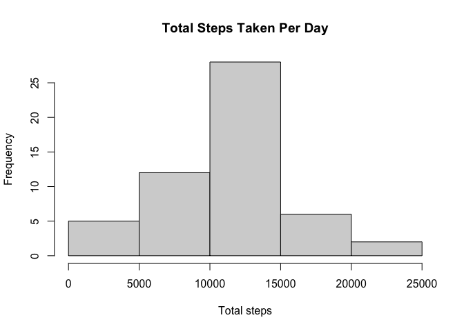
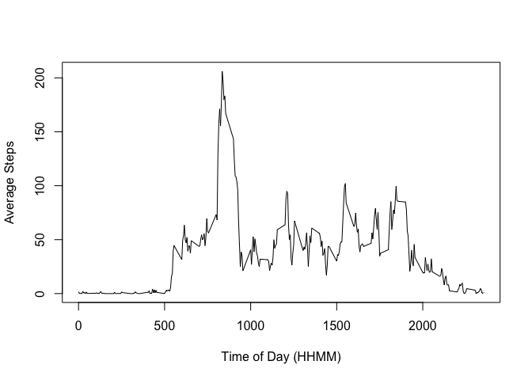
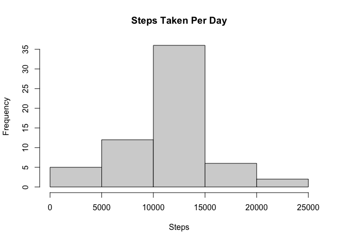
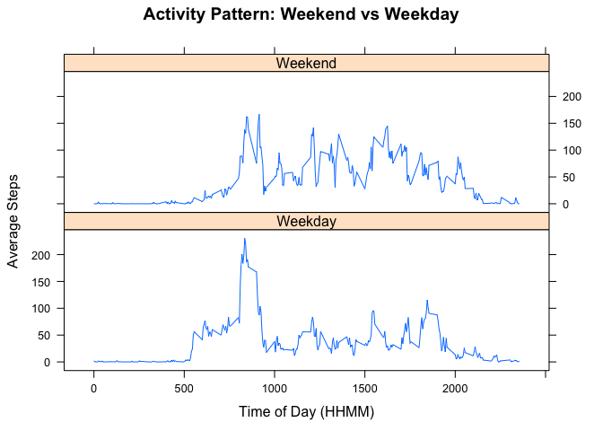

## Loading and preprocessing the data

```r
unzip(zipfile = "./activity.zip", exdir = "./")
activity_data <- read.csv("./activity.csv", header = TRUE)
activity_data$interval <-  sprintf("%04d", activity_data$interval)
activity_data$date_time <- paste(activity_data$date, activity_data$interval)
activity_data$date_time <- strptime(activity_data$date_time, "%Y-%m-%d %H%M")
```


## What is mean total number of steps taken per day?
Create dataframe of daily steps by date:

```r
library(dplyr)
daily_steps <- activity_data %>%
                group_by(date) %>%
                summarize(total_steps = sum(steps))
head(daily_steps)
```

```
## # A tibble: 6 x 2
##   date       total_steps
##   <chr>            <int>
## 1 2012-10-01          NA
## 2 2012-10-02         126
## 3 2012-10-03       11352
## 4 2012-10-04       12116
## 5 2012-10-05       13294
## 6 2012-10-06       15420
```

Create histogram of total steps taken per day:

```r
hist(daily_steps$total_steps, main = "Total Steps Taken Per Day",
     xlab = "Total steps")
```

<!-- -->

Print mean and median total number of steps taken each day:

```r
paste("Mean:", round(mean(daily_steps$total_steps, na.rm = TRUE), digits = 0))
```

```
## [1] "Mean: 10766"
```

```r
paste("Median:", median(daily_steps$total_steps, na.rm = TRUE))
```

```
## [1] "Median: 10765"
```


## What is the average daily activity pattern?
Create dataframe of average daily activity:

```r
avg_int_steps <- activity_data %>%
                    group_by(interval) %>%
                    summarize(AvgSteps = mean(steps, na.rm = TRUE))
head(avg_int_steps)
```

```
## # A tibble: 6 x 2
##   interval AvgSteps
##   <chr>       <dbl>
## 1 0000       1.72  
## 2 0005       0.340 
## 3 0010       0.132 
## 4 0015       0.151 
## 5 0020       0.0755
## 6 0025       2.09
```


Create line plot of results:

```r
plot(avg_int_steps$interval, avg_int_steps$AvgSteps, type = "l",
     ylab = "Average Steps", xlab = "Time of Day (HHMM)")
```

<!-- -->

Paste message of time of day with highest avg step count:

```r
avg_int_steps <- avg_int_steps %>%
                  arrange(desc(AvgSteps))

paste("The time of day with the highest average step count is",
      avg_int_steps[1,1], "with an average step count of ",
      round(avg_int_steps[1,2], digits = 0))
```

```
## [1] "The time of day with the highest average step count is 0835 with an average step count of  206"
```


## Imputing missing values
Count number of NA rows in data

```r
sum(is.na(activity_data$steps))
```

```
## [1] 2304
```

Replace NA values with average steps of time interval:

```r
act_data_complete <- activity_data %>%
                    group_by(interval) %>%
                    mutate(steps=ifelse(is.na(steps),
                                        mean(steps,na.rm=TRUE),
                                        steps))
head(act_data_complete)
```

```
## # A tibble: 6 x 4
## # Groups:   interval [6]
##    steps date       interval date_time          
##    <dbl> <chr>      <chr>    <dttm>             
## 1 1.72   2012-10-01 0000     2012-10-01 00:00:00
## 2 0.340  2012-10-01 0005     2012-10-01 00:05:00
## 3 0.132  2012-10-01 0010     2012-10-01 00:10:00
## 4 0.151  2012-10-01 0015     2012-10-01 00:15:00
## 5 0.0755 2012-10-01 0020     2012-10-01 00:20:00
## 6 2.09   2012-10-01 0025     2012-10-01 00:25:00
```

Create summary dataframe of completed data set with imputed values:

```r
daily_steps_complete <- act_data_complete %>%
                group_by(date) %>%
                summarize(total_steps = sum(steps))
head(daily_steps_complete)
```

```
## # A tibble: 6 x 2
##   date       total_steps
##   <chr>            <dbl>
## 1 2012-10-01      10766.
## 2 2012-10-02        126 
## 3 2012-10-03      11352 
## 4 2012-10-04      12116 
## 5 2012-10-05      13294 
## 6 2012-10-06      15420
```

Create histogram of results:

```r
hist(daily_steps_complete$total_steps, main = "Steps Taken Per Day",
     xlab = "Steps")
```

<!-- -->

Print out mean and median:

```r
paste("Mean:", round(mean(daily_steps_complete$total_steps, 
                          na.rm = TRUE), digits = 0))
```

```
## [1] "Mean: 10766"
```

```r
paste("Median:", round(median(daily_steps_complete$total_steps, 
                              na.rm = TRUE), digits = 0))
```

```
## [1] "Median: 10766"
```
The mean and median with imputed values is almost identical to the mean and 
median with NAs removed. 

## Are there differences in activity patterns between weekdays and weekends?
Identify day of week and categorize as weekend or weekday:

```r
act_data_complete$day <- weekdays(act_data_complete$date_time)
act_data_complete$we <- ifelse(act_data_complete$day %in% c("Saturday","Sunday"), "Weekend", "Weekday")

compl_avg <- act_data_complete %>%
                group_by(interval, we) %>%
                summarize(avg_steps = mean(steps))

compl_avg$interval <- as.integer(compl_avg$interval)
head(compl_avg)
```

```
## # A tibble: 6 x 3
## # Groups:   interval [3]
##   interval we      avg_steps
##      <int> <chr>       <dbl>
## 1        0 Weekday    2.25  
## 2        0 Weekend    0.215 
## 3        5 Weekday    0.445 
## 4        5 Weekend    0.0425
## 5       10 Weekday    0.173 
## 6       10 Weekend    0.0165
```

Generate plot comparing weekend vs weekday activity:

```r
library(lattice)
xyplot(avg_steps ~ interval | we, data = compl_avg,
       type = "l", layout = c(1,2),
       ylab = "Average Steps", xlab = "Time of Day (HHMM)",
       main = "Activity Pattern: Weekend vs Weekday")
```

<!-- -->

Activity on weekends appears to be more consistent throughout the day.
